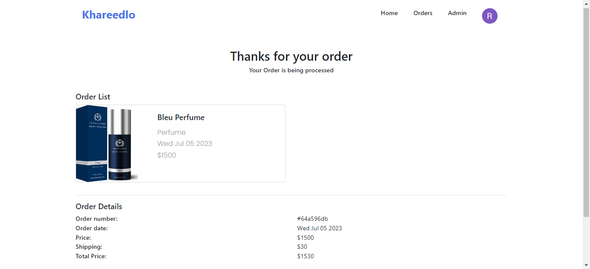

# Khareedlo Frontend

This is the frontend repository for the Khareedlo project. Khareedlo is an online marketplace platform where users can buy and sell various products. This repository contains the client-side code responsible for the user interface and interaction.

## Table of Contents

- [Installation](#installation)
- [Usage](#usage)
- [Contributing](#contributing)
- [Screenshots](#screenshots)

## Installation

To install and run the Khareedlo frontend locally, follow these steps:

1. Clone the repository:
   git clone https://github.com/rabees/khareedlo-frontend.git

2. Change to the project directory:
   cd khareedlo-frontend

3. Install the dependencies:
   npm install

4. Start the development server:
   npm start

5. Open your web browser and visit `http://localhost:3000` to access the Khareedlo application.

## Usage

Once the Khareedlo frontend is running, you can use the application to browse and interact with the marketplace. Here are the key features available:

- **Signup**: Create a new user account to start using Khareedlo.
- **Signin**: Log in to your existing account to access your profile and features.
- **Order**: View and manage your orders, including tracking shipment status.
- **Search**: Search for products based on keywords, categories, or other filters.
- **Products**: Browse and view details of available products in the marketplace.
- **Admin Panel**: Access the admin panel for managing products.

## Contributing

Contributions to Khareedlo are welcome! If you would like to contribute to this project, please follow these steps:

1. Fork the repository on GitHub.
2. Create a new branch from the `master` branch for your feature or bug fix.
3. Make your changes and commit them to your branch.
4. Push your changes to your forked repository.
5. Submit a pull request to the `master` branch of the original repository.

## Screenshots

Here are some screenshots showcasing the Khareedlo frontend:

1. **Signup**: 
   _The signup page allows users to create a new account._

2. **Signin**: 
   _The signin page enables users to log in to their existing account._

3. **Products**: 
   _The products page displays available products with their details and prices._

4. **Search**: 
   _The search page provides a search bar and filters to find specific products._

5. **Checkout**: 
   _The checkout page allows users to buy the items in the cart._
6. **Order**: 
   _The order page shows a list of orders and their status, including tracking information._

7. **Admin Panel**:   
   _The admin panel provides a dedicated interface for managing products._
